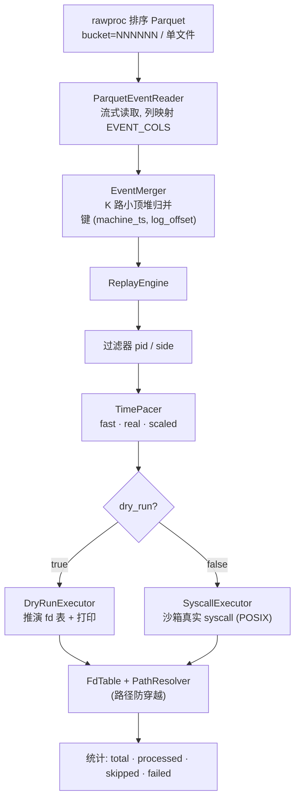
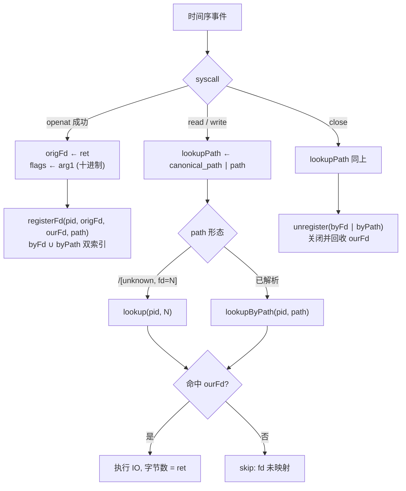

# trace-replay 项目介绍

> 按时间序列回放 rawproc 排序后的 Parquet trace 事件流，在受限沙箱内真实执行 syscall，以还原存储迁移工作负载的时序行为。

---

## 1. 背景与动机

存储迁移期间，源端文件系统上的真实工作负载（文件读写、元数据操作）被 `bpftrace` 采集，经 `rawproc`（`rawproc_spark.py`）解析、挂载映射并按时间分桶排序，产出 `events_tsorted/bucket=NNNNNN` 形态的 Parquet 数据集。`rawproc` 的职责止于"解析与排序"，它**不接触 fd**，也不执行任何 syscall。

本项目（对应 context.md 中的 **openat-replay**）消费 `rawproc` 的输出，完成最后一环：把已排序的离散事件流**还原为可执行的时间序列**，在隔离沙箱中逐条重放，从而

* 评估迁移目标端在真实负载时序下的吞吐与延迟；
* 校验 fd 生命周期、路径访问模式是否与原始 trace 一致；
* 在不依赖原始数据内容的前提下，复现"某 fd 上发生 N 字节 IO"的**时间序列语义**。

核心设计原则：**以 fd 为准，而非 path。**

---

## 2. 与 rawproc 的分工

| 阶段 | 职责 | 是否涉及 fd |
|---|---|---|
| `bpftrace` 采集 | 抓取 syscall 入口/出口参数 | 否 |
| `rawproc` 解析 | 行正则、挂载映射、`floor(machine_ts/600)` 分桶、按 `(machine_ts, log_offset)` 排序 | 否 |
| **trace-replay** | 全局时间序归并、fd 表维护、路径防穿越、真实 syscall 执行 | **是** |

`rawproc` 排序保证两条不变量：桶间全局有序、无重叠；桶内按 `(machine_ts, log_offset)` 有序。本项目正是利用这一不变量，将分桶输出重新归并为单一全局时间序。

---

## 3. 系统架构



### 3.1 输入层：ParquetEventReader

兼容两种输入形态：

1. **分桶目录**（rawproc 标准产出）：枚举 `events_tsorted/bucket=NNNNNN` 下的 `.parquet` part 文件，合并为单表后顺序吐出；
2. **单文件直读**：当 `events_root` 直接指向一个 `.parquet` 文件时绕过分桶逻辑，单 reader 直读。适用于用户提供的扁平 part 文件（已全局排序），此时归并器 K 路堆退化为直通。

读取器按 `rawproc` 的 `EVENT_COLS` 列名映射，并把 `ret`/`err`/`arg1`/`arg2` 这些**十进制字符串列**解析为数值。`string_view` 字段指向 Arrow 内部缓冲，在 Table 存活期内稳定。

### 3.2 归并层：EventMerger

为每个桶创建一个 `ParquetEventReader`，再做 **K 路小顶堆归并**。堆节点比较键为 `(machine_ts, log_offset)`——与 `rawproc` 排序键一致，保证全局稳定。这便是 replay 时间序列的来源。

### 3.3 引擎层：ReplayEngine

编排"归并 → 过滤 → 节拍 → 执行"四阶段，并维护运行统计：

* **过滤器**：按 `pid_filter` 与 `side_filter`（source/target/all）裁剪事件流；
* **TimePacer**：三种节拍模式
  * `fast`——不 sleep，尽快按时间序处理（默认，关注正确性与吞吐）；
  * `real`——按原始事件间墙钟间隔 1:1 还原真实时间分布；
  * `scaled`——按 `speed` 倍速缩放间隔。

### 3.4 执行层：IExecutor 双实现

| 执行器 | 行为 | 适用 |
|---|---|---|
| `DryRunExecutor` | 不执行真实 syscall，仅推演 fd 表与路径并打印每条事件 | 校验解析/排序/fd 映射逻辑，安全可重复 |
| `SyscallExecutor` | 在沙箱内真实执行 `openat`/`read`/`write`/`rename` 等 | 真实回放（仅 POSIX 平台）|

`SyscallExecutor` 复现的是**时间序列语义**而非数据内容：trace 不含数据负载，故 `read` 用零缓冲、`write` 写零字节占位，目的是还原"该 fd 上发生 N 字节 IO"的时序与 fd 生命周期。

---

## 4. fd 跟踪策略

这是本项目的技术核心。真实数据验证表明，`rawproc` 输出中各列语义如下：

| syscall | `ret` | `arg1` | `arg2` | fd 获取方式 |
|---|---|---|---|---|
| `openat` | **原始 fd**（成功时小整数）| flags（十进制，如 `524288`=O_CLOEXEC）| mode | 以 `ret` 建表 |
| `read`/`write` | 实际字节数 | 请求字节数 count（**非 fd**）| — | path 反查 |
| `pread64`/`pwrite64` | 实际字节数 | count | offset | path 反查 |
| `close` | 0 | 0 | 0 | path 反查 |

关键结论：**IO 类操作的 fd 不在任何 arg 列中**（`arg1` 是字节数），只能通过 `path`/`canonical_path` 反查。绝大多数 IO 的 `path` 已解析为完整路径，少数为 `/[unknown, fd=N]` 形态。



策略要点：

* **openat 建表**：成功时以 `(pid, origFd=ret)` 为键登记，记录本回放进程真实打开得到的 `ourFd` 与 `path`。flags 取 `arg1`，经 `translateOpenFlags` 按位映射访问模式与 `O_CREAT`/`O_TRUNC`/`O_APPEND`/`O_CLOEXEC` 等。
* **IO/close 反查**：以 `bestLookupPath(ev)`（`canonical_path` 优先，退化 `path`）在该 pid 的 fd 表中反查 `ourFd`；对 `/[unknown, fd=N]` 形态从串中提取 N，回退为 fd 直查。
* **双索引同步**：`FdTable` 维护 `byFd`（origFd→entry）与 `byPath`（canonicalPath→origFd）两张索引，open 注册、close 注销时同步更新，允许同一路径被多次打开（多 fd 指向同路径，取最近登记者）。

---

## 5. 路径解析与安全

`PathResolver` 将原始 trace 路径解析为"沙箱内绝对路径"并强制**防穿越校验**（对齐 Cubium 规范：验证外部输入、防止路径遍历）：

1. 优先用 `canonical_path`（rawproc 已映射到统一 CAPFS 命名空间）；`mapped=false` 或为空时退化用 `path`。
2. 以 `/` 开头视为绝对路径，拼到 `sandboxRoot` 下；否则视为相对路径，需 `dirfd`（`AT_FDCWD=-100` 相对沙箱根，否则查 fd 表得目录路径再拼）。
3. `weakly_canonical` 规范化后断言结果仍在 `sandboxRoot` 之下，否则拒绝执行该事件。

---

## 6. 配置

运行参数集中于一个 JSON 配置文件，命令行用法：`trace_replay <config.json>`。

| 字段 | 含义 | 默认 |
|---|---|---|
| `events_root` | rawproc 产出根目录，或直接指向单个 `.parquet` 文件 | — |
| `sandbox_root` | 真实 syscall 根目录，所有路径强制落其下 | — |
| `bucket_min` / `bucket_max` | 只回放该桶编号范围（闭区间，`-1` 无上限）| `0` / `-1` |
| `pace_mode` | `fast` / `real` / `scaled` | `fast` |
| `speed` | `scaled` 模式倍速 | `1.0` |
| `side_filter` | `all` / `source` / `target` | `all` |
| `pid_filter` | 只回放这些 pid（空=全部）| `[]` |
| `skip_unparsed` | 是否跳过 `_unparsed`/`null_ts` 桶 | `true` |
| `dry_run` | `true`=仅推演不执行 syscall | `false` |
| `max_io_bytes` | 单次 IO 上限 | `1048576` |
| `continue_on_error` | syscall 失败时是否继续 | `true` |
| `max_events` | 回放事件上限（`0`=不限，便于有界 dry-run）| `0` |

---

## 7. 构建

C++20，依赖 Apache Arrow（含 Parquet）与 nlohmann_json，经 vcpkg manifest 模式自动安装。Windows 下使用 clang++（GNU 风格）+ Ninja Multi-Config，需先注入 VS 开发环境（本机 VS 预览版不被 `vswhere` 识别，vcpkg 依赖 `cl.exe` 定位工具链）。

```bat
scripts\configure.bat          :: 仅配置
scripts\configure.bat build    :: 配置 + 构建
```

产物为 `build/bin/{Debug,Release}/trace_replay.exe`，依赖的 Arrow/Parquet DLL 由 vcpkg 自动部署到同目录。

> `SyscallExecutor` 依赖 POSIX（`openat`/`pread64`/`rename`…），仅 Linux 构建可真实回放；Windows 下为占位实现，仅 `DryRunExecutor` 与解析层可运行。

---

## 8. 验证

在真实迁移 trace（340 MB，约 1746 万行）上以 `DryRunExecutor` 做有界 dry-run（`max_events=200000`）：

| 指标 | 值 |
|---|---|
| 处理事件 | 200000 |
| 跳过（fd 未映射）| 23705（11.9%）|
| 失败（路径穿越等）| 0 |
| 时间范围 | ts ∈ [5082000.000019, 5082005.585218] |
| syscall 分布 | read 193414 / newfstatat 2192 / openat 2183 / close 2182 / write 26 |

跳过率随回放窗口增大而下降（5k 窗口 45.6% → 200k 窗口 11.9%），证实跳过主要源于回放起点之前已打开的 fd 上的 read，属合理的边界效应；`failed=0` 表明路径防穿越校验无误杀。逐 fd 抽样验证：`openat ret=23` 建表后，同 path 的后续 `read` 经 `lookupByPath` 正确解析到 `ourFd=23`，未被跳过。

---

## 9. 已知 TODO

* `dup`/`dup2`/`dup3`、`exit(group)` 对 fd 表的影响尚未覆盖；
* `getdents`/`utimensat`/xattr 等暂未真实执行（标记 skipped）；
* 单元测试框架尚未接入（`TR_TRACE_REPLAY_BUILD_TESTS` 占位）；
* Windows 下 `SyscallExecutor` 为占位实现，真实回放需移植到 Win32 API。

---

## 附：目录结构

```
trace-replay/
├── CMakeLists.txt
├── cmake/CompilerWarnings.cmake
├── config.example.json
├── include/trace_replay/
│   ├── core/    Types · Assert · Error · Result · TraceEvent · SyscallClassify · TraceEventUtil
│   ├── config/  ReplayConfig
│   ├── io/      IEventReader · ParquetEventReader · EventMerger
│   ├── model/   FdTable · PathResolver
│   └── replay/  IExecutor · TimePacer · DryRunExecutor · SyscallExecutor · ReplayEngine
├── src/         （与 include 一一对应的 .cpp + main.cpp）
└── README.md
```
