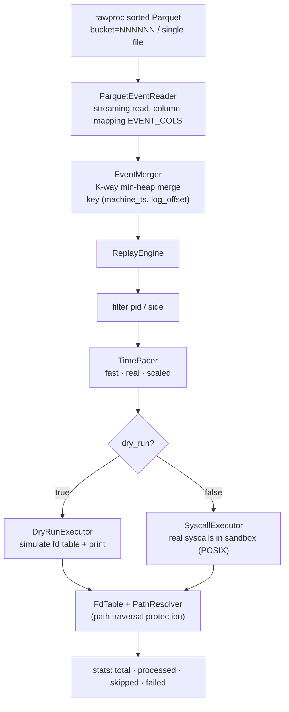
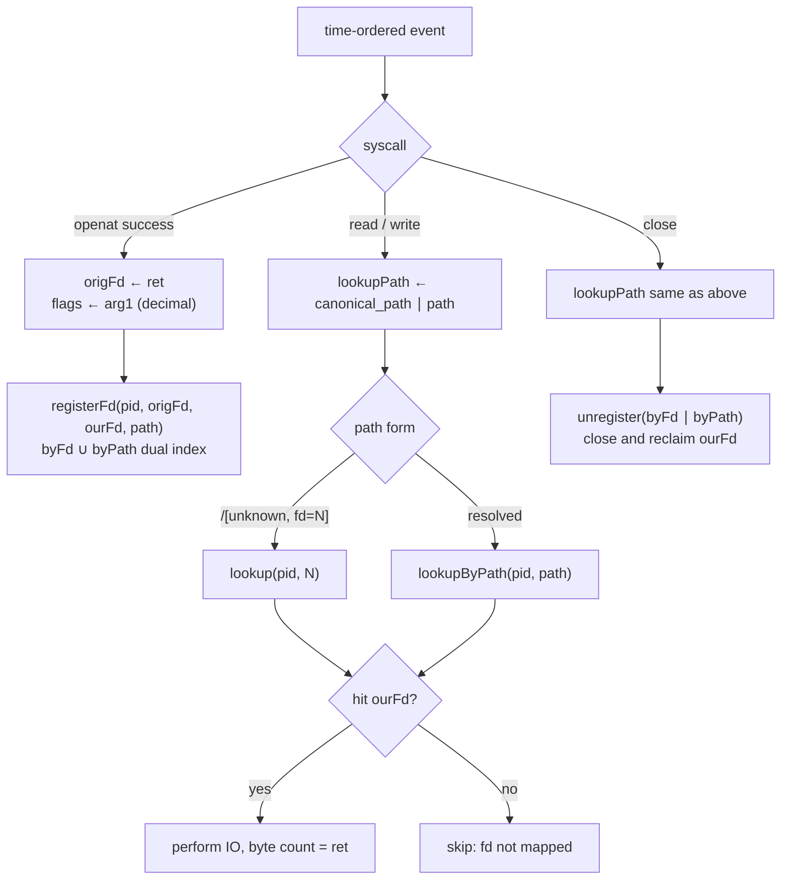

# trace-replay Project Overview

> Replays the event stream of a rawproc-sorted Parquet trace in time-series order, executing real syscalls inside a restricted sandbox to reproduce the timing behavior of a storage-migration workload.

---

## 1. Background and motivation

During a storage migration, the real workload on the source filesystem (file reads/writes, metadata operations) is captured by `bpftrace`, then parsed, mount-mapped, time-bucketed, and sorted by `rawproc` (`rawproc_spark.py`), producing a Parquet dataset of the form `events_tsorted/bucket=NNNNNN`. `rawproc`'s responsibility stops at "parse and sort": it **does not touch fd** and executes no syscalls.

This project (corresponding to **openat-replay** in context.md) consumes `rawproc`'s output and completes the final stage: **restoring the sorted, discrete event stream into an executable time series**, replaying each event one by one in an isolated sandbox, in order to:

* evaluate the throughput and latency of the migration target under the real load timing;
* verify that fd lifecycles and path access patterns are consistent with the original trace;
* reproduce the **time-series semantics** of "N bytes of IO occurred on some fd" without depending on the original data content.

Core design principle: **fd takes precedence over path.**

---

## 2. Division of labor with rawproc

| Stage | Responsibility | Touches fd? |
|---|---|---|
| `bpftrace` capture | grab syscall entry/exit arguments | No |
| `rawproc` parsing | line regex, mount mapping, `floor(machine_ts/600)` bucketing, sort by `(machine_ts, log_offset)` | No |
| **trace-replay** | global time-ordered merge, fd table maintenance, path traversal protection, real syscall execution | **Yes** |

`rawproc` sorting guarantees two invariants: buckets are globally ordered and non-overlapping; within a bucket, events are ordered by `(machine_ts, log_offset)`. This project exploits that invariant to re-merge the bucketed output into a single global time order.

---

## 3. System architecture



### 3.1 Input layer: ParquetEventReader

Compatible with two input forms:

1. **Bucketed directory** (standard rawproc output): enumerate the `.parquet` part files under `events_tsorted/bucket=NNNNNN`, merge them into a single table, and emit events in order.
2. **Single-file direct read**: when `events_root` points directly to a `.parquet` file, the bucketing logic is bypassed and a single reader reads it directly. This suits a flat part file supplied by the user (already globally sorted); here the merger's K-way heap degenerates to a passthrough.

The reader maps columns according to rawproc's `EVENT_COLS` names, and parses the `ret`/`err`/`arg1`/`arg2` **decimal-string columns** into numeric values. `string_view` fields point into Arrow's internal buffers and stay valid for the lifetime of the Table.

### 3.2 Merge layer: EventMerger

Creates one `ParquetEventReader` per bucket and then performs a **K-way min-heap merge**. The heap node comparison key is `(machine_ts, log_offset)` — identical to rawproc's sort key, ensuring global stability. This is the source of the replay time series.

### 3.3 Engine layer: ReplayEngine

Orchestrates the four stages "merge → filter → pace → execute" and maintains run statistics:

* **Filter**: trims the event stream by `pid_filter` and `side_filter` (source/target/all);
* **TimePacer**: three pacing modes
  * `fast` — no sleep, process in time order as fast as possible (default; focuses on correctness and throughput);
  * `real` — reproduce the real-time distribution 1:1 by sleeping the original wall-clock gaps between events;
  * `scaled` — scale the gaps by the `speed` multiplier.

### 3.4 Execution layer: IExecutor dual implementation

| Executor | Behavior | Use case |
|---|---|---|
| `DryRunExecutor` | does not execute real syscalls; only simulates the fd table and paths, and prints each event | verifying parse/sort/fd-mapping logic; safe and repeatable |
| `SyscallExecutor` | actually executes `openat`/`read`/`write`/`rename` etc. inside the sandbox | real replay (POSIX platforms only) |

`SyscallExecutor` reproduces **time-series semantics**, not data content: the trace carries no data payload, so `read` uses a zero buffer and `write` writes zero bytes as a placeholder. The goal is to reproduce the timing and fd lifecycle of "N bytes of IO occurred on this fd".

---

## 4. fd tracking strategy

This is the technical core of the project. Real-data verification shows that in rawproc's output each column has the following semantics:

| syscall | `ret` | `arg1` | `arg2` | how fd is obtained |
|---|---|---|---|---|
| `openat` | **original fd** (a small integer on success) | flags (decimal, e.g. `524288`=O_CLOEXEC) | mode | build the table from `ret` |
| `read`/`write` | actual byte count | requested byte count (**not fd**) | — | reverse-lookup by path |
| `pread64`/`pwrite64` | actual byte count | count | offset | reverse-lookup by path |
| `close` | 0 | 0 | 0 | reverse-lookup by path |

Key conclusion: **the fd of an IO operation is not in any arg column** (`arg1` is a byte count); it can only be reverse-looked up via `path`/`canonical_path`. For the vast majority of IO events `path` is already resolved to a full path; a few are in the form `/[unknown, fd=N]`.



Strategy points:

* **openat builds the table**: on success, register under the key `(pid, origFd=ret)`, recording the `ourFd` actually opened by this replay process and the `path`. flags come from `arg1` and are bitwise-mapped via `translateOpenFlags` into an access mode plus `O_CREAT`/`O_TRUNC`/`O_APPEND`/`O_CLOEXEC`, etc.
* **IO/close reverse-lookup**: use `bestLookupPath(ev)` (`canonical_path` preferred, falling back to `path`) to reverse-look up `ourFd` in that pid's fd table; for the `/[unknown, fd=N]` form, extract N from the string and fall back to a direct fd lookup.
* **Dual-index synchronization**: `FdTable` maintains two indices — `byFd` (origFd→entry) and `byPath` (canonicalPath→origFd) — updated in sync on open registration and close unregistration. The same path may be opened multiple times (multiple fds pointing to the same path); the most recently registered one is taken.

---

## 5. Path resolution and security

`PathResolver` resolves the original trace path into an "absolute path inside the sandbox" and enforces **path-traversal protection** (aligned with the Cubium spec: validate external input, prevent path traversal):

1. Prefer `canonical_path` (rawproc already maps it into a unified CAPFS namespace); fall back to `path` when `mapped=false` or it is empty.
2. A leading `/` is treated as an absolute path, appended under `sandboxRoot`; otherwise it is a relative path and needs a `dirfd` (`AT_FDCWD=-100` means relative to the sandbox root; otherwise look up the directory path via the fd table and append).
3. After `weakly_canonical` normalization, assert the result is still under `sandboxRoot`; otherwise refuse to execute that event.

---

## 6. Configuration

Run parameters are consolidated in a single JSON config file; command-line usage: `trace_replay <config.json>`.

| Field | Meaning | Default |
|---|---|---|
| `events_root` | rawproc output root directory, or a direct pointer to a single `.parquet` file | — |
| `sandbox_root` | root directory for real syscalls; all paths are forced under it | — |
| `bucket_min` / `bucket_max` | only replay this bucket-number range (closed interval; `-1` = no upper bound) | `0` / `-1` |
| `pace_mode` | `fast` / `real` / `scaled` | `fast` |
| `speed` | speed multiplier for `scaled` mode | `1.0` |
| `side_filter` | `all` / `source` / `target` | `all` |
| `pid_filter` | only replay these pids (empty = all) | `[]` |
| `skip_unparsed` | whether to skip `_unparsed`/`null_ts` buckets | `true` |
| `dry_run` | `true` = simulate only, do not execute syscalls | `false` |
| `max_io_bytes` | per-IO upper bound | `1048576` |
| `continue_on_error` | whether to continue on syscall failure | `true` |
| `max_events` | replay event cap (`0` = unlimited; useful for bounded dry-run) | `0` |

---

## 7. Build

C++20, depends on Apache Arrow (with Parquet) and nlohmann_json, auto-installed via vcpkg manifest mode. On Windows, use clang++ (GNU-style) + Ninja Multi-Config; the VS development environment must be injected first (the VS Preview on this machine is not recognized by `vswhere`, and vcpkg relies on `cl.exe` to locate the toolchain).

```bat
scripts\configure.bat          :: configure only
scripts\configure.bat build    :: configure + build
```

The output is `build/bin/{Debug,Release}/trace_replay.exe`; the dependent Arrow/Parquet DLLs are automatically deployed by vcpkg to the same directory.

> `SyscallExecutor` depends on POSIX (`openat`/`pread64`/`rename`…); only the Linux build can perform real replay. On Windows it is a placeholder implementation; only `DryRunExecutor` and the resolution layer can run.

---

## 8. Verification

A bounded dry-run (`max_events=200000`) was performed with `DryRunExecutor` on a real migration trace (340 MB, ~17.46 million lines):

| Metric | Value |
|---|---|
| Events processed | 200000 |
| Skipped (fd not mapped) | 23705 (11.9%) |
| Failed (path traversal, etc.) | 0 |
| Time range | ts ∈ [5082000.000019, 5082005.585218] |
| syscall distribution | read 193414 / newfstatat 2192 / openat 2183 / close 2182 / write 26 |

The skip rate drops as the replay window grows (45.6% at a 5k window → 11.9% at a 200k window), confirming that skips are mainly reads on fds opened before the replay start point — a reasonable boundary effect; `failed=0` shows the path-traversal check produces no false positives. Per-fd sampling verification: after `openat ret=23` built the table, subsequent `read` on the same path correctly resolved to `ourFd=23` via `lookupByPath` and was not skipped.

---

## 9. Known TODOs

* The effects of `dup`/`dup2`/`dup3` and `exit(group)` on the fd table are not yet covered;
* `getdents`/`utimensat`/xattr etc. are not yet executed for real (marked as skipped);
* The unit test framework is not yet wired up (`TR_TRACE_REPLAY_BUILD_TESTS` placeholder);
* On Windows, `SyscallExecutor` is a placeholder implementation; real replay requires porting to the Win32 API.

---

## Appendix: directory structure

```
trace-replay/
├── CMakeLists.txt
├── cmake/CompilerWarnings.cmake
├── config.example.json
├── include/trace_replay/
│   ├── core/    Types · Assert · Error · Result · TraceEvent · SyscallClassify · TraceEventUtil
│   ├── config/  ReplayConfig
│   ├── io/      IEventReader · ParquetEventReader · EventMerger
│   ├── model/   FdTable · PathResolver
│   └── replay/  IExecutor · TimePacer · DryRunExecutor · SyscallExecutor · ReplayEngine
├── src/         (.cpp files one-to-one with include + main.cpp)
└── README.md
```
